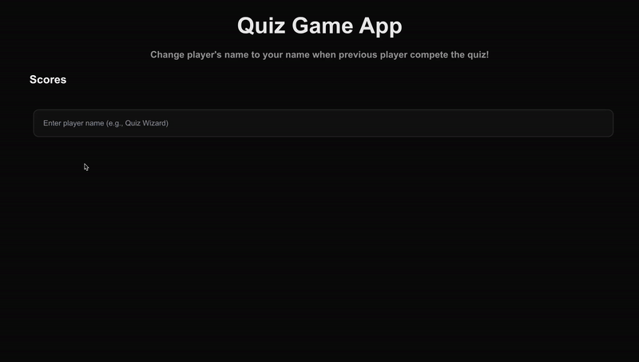

# nhost Quiz App
A multiplayer quiz app powered by nhost, Next.js and AWS Lambda.
Two players can play on the same machine's browser to answer by taking turns. Scores will display when all answers were selected.



## Prerequisite environment
- npm: 10.8.2
- node: 20.18.0
- React: ^18
- Next.js: 14.2.21

> [!WARNING]
> Next.js version should be lower than Next 15 to prevent getting an incompatibility from [nhost Next.js client library](https://docs.nhost.io/reference/nextjs/nhost-client).

## Run a quiz app
1. Install dependencies.

```bash
npm i
```

2. Run the development server:

```bash
npm run dev
```

3. Open [http://localhost:3000](http://localhost:3000) with your browser to see the result.

- `src/app/page.js`is the wrapper of the main quiz component.
- `src/app/quiz/page.jsx` is the main quiz component.
- `src/app/api/quiz/route.js` is the API interactions with an `evaluate` endpoint and serverless function (Lambda).
- `src/lib/nhost.js` is the nhost client config file.

## How to play the quiz game

1. Fill out a player name
2. Click anywhere to confirm registering a player name
3. Quiz will show up
4. Select one answer per question
5. Hit a "Submit button" to submit your solutions
6. Players updated score will be displayed
7. Register next player's name to start playing the quiz game
8. Repeat

## Requirements Achievement
- [x] Use Next.js
- [x] Display all questions and answer options data from nhost SDK interaction (Dedicated subdomain and the region. Utilize GraphQL playground)
- [x] Allowing players to choose one solution (answer) per question
- [x] Submit solution (POST) to serverside Lambda function (`nhost.functions.call()` & a dedicated `evaluate` endpint)
- [x] Track each player's score & display it on the UI
- [x] Multiplayer mode
- [x] Local multiplayer mode on a single machine
- [x] Instruction on README


## Additional Features
- [x] Responsive design (Style: Tailwind CSS)
- [x] Mobile-first UI design for maintainability
- [x] Accessiblity (100 scores in Lighthouse and 0 issues in axe DevTools)
- [x] Form submittion logic with radio buttons to only allow players to choose one answer per question
- [x] Unique player name registration feature to display on the score
- [x] Next.js' [Router Handles](https://nextjs.org/docs/app/building-your-application/routing/route-handlers) Function to handle tasks (i.e. Data upload, request and accessing database, etc) for better performance. Functions are only executed when specified route is accessed. → Minimum serverside processing

## Future Improvements

- [ ] TypeScript support
- [ ] Style improvement
- [ ] Dark mode & light mode switch option
- [ ] Mobile event-supported style (i.e. Tapped component style change on tap.)
- [ ] (UI) Display one question to select an answer and go to the next question when a player clicks "submit" or "next question" button
- [ ] Quiz progress bar UI
- [ ] Count down timer
- [ ] "Previous" button to go back & update the previous quesion's answer
- [ ] An input or button element to confirm user name registration before displaying questions
- [ ] E2E & Unit testing
- [ ] GitHub actions to set up the correct toolchain for build environment, or set up the authentication to the cloud provider